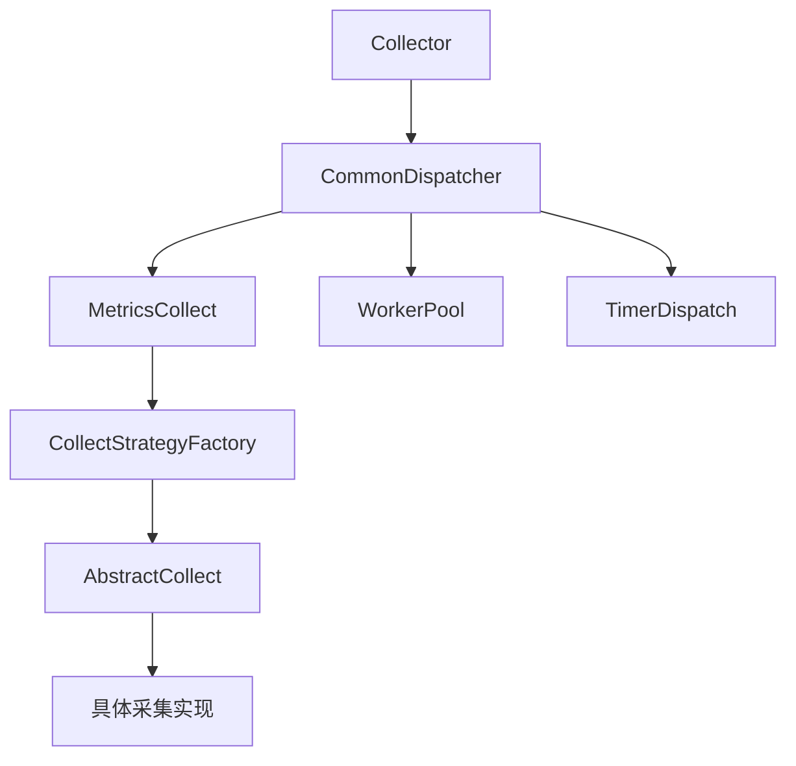

# HertzBeat Collector 架构分析报告

## 1. 项目概述

HertzBeat Collector 是 HertzBeat 监控系统的数据采集组件，负责执行各种监控指标的采集任务。它是一个基于 Java 17 和 Spring Boot 的分布式采集器。

## 2. 模块结构

```
hertzbeat-collector/
├── hertzbeat-collector-basic/      # 基础采集实现
├── hertzbeat-collector-common/     # 公共组件和接口
├── hertzbeat-collector-collector/  # 核心调度器
├── hertzbeat-collector-kafka/      # Kafka 采集扩展
├── hertzbeat-collector-mongodb/    # MongoDB 采集扩展
├── hertzbeat-collector-nebulagraph/# NebulaGraph 采集扩展
└── hertzbeat-collector-rocketmq/   # RocketMQ 采集扩展
```

## 3. 核心组件分析

### 3.1 入口类 - Collector.java

**路径**: `hertzbeat-collector-collector/src/main/java/org/apache/hertzbeat/collector/Collector.java`

- Spring Boot 启动类
- 扫描 `org.apache.hertzbeat` 包下的所有组件
- 设置 JNDI 安全属性

### 3.2 任务调度器 - CommonDispatcher

**路径**: `hertzbeat-collector-collector/src/main/java/org/apache/hertzbeat/collector/dispatch/CommonDispatcher.java`

**核心功能**:
- 实现 `MetricsTaskDispatch` 和 `CollectDataDispatch` 接口
- 管理采集任务队列 (`MetricsCollectorQueue`)
- 调度时间轮任务 (`TimerDispatch`)
- 监控任务执行超时 (240秒)
- 处理子任务拆分和聚合

**关键流程**:
1. 从任务队列拉取采集任务
2. 提交到工作线程池执行
3. 监控任务超时
4. 处理任务完成后的数据分发

### 3.3 采集任务 - MetricsCollect

**路径**: `hertzbeat-collector-collector/src/main/java/org/apache/hertzbeat/collector/dispatch/MetricsCollect.java`

**核心功能**:
- 实现 `Runnable` 接口，作为可执行采集任务
- 支持优先级排序 (`Comparable`)
- 字段计算和别名替换
- 单位转换

**执行流程**:
1. 设置线程名称
2. 构建响应对象
3. 根据协议选择采集策略
4. 执行采集逻辑
5. 计算字段值
6. 验证响应数据
7. 分发采集结果

### 3.4 采集策略工厂 - CollectStrategyFactory

**路径**: `hertzbeat-collector-collector/src/main/java/org/apache/hertzbeat/collector/collect/strategy/CollectStrategyFactory.java`

**核心功能**:
- 使用 SPI (Service Provider Interface) 机制加载采集实现
- 维护协议到采集实现的映射
- 支持动态扩展采集协议

### 3.5 抽象采集类 - AbstractCollect

**路径**: `hertzbeat-collector-common/src/main/java/org/apache/hertzbeat/collector/collect/AbstractCollect.java`

**核心方法**:
- `preCheck()`: 采集前参数校验
- `collect()`: 实际采集逻辑
- `supportProtocol()`: 返回支持的协议类型

### 3.6 工作线程池 - WorkerPool

**路径**: `hertzbeat-collector-common/src/main/java/org/apache/hertzbeat/collector/dispatch/WorkerPool.java`

**配置**:
- 核心线程数: `max(2, CPU核心数)`
- 最大线程数: `CPU核心数 * 16`
- 空闲线程存活时间: 10秒
- 使用 `SynchronousQueue` 作为任务队列
- 拒绝策略: `AbortPolicy`

## 4. 支持的采集协议

### 4.1 基础协议 (hertzbeat-collector-basic)

| 协议 | 实现类 | 说明 |
|------|--------|------|
| **jdbc** | JdbcCommonCollect | 数据库 JDBC 采集（MySQL/PostgreSQL/Oracle等） |
| **dns** | DnsCollectImpl | DNS 解析采集 |
| **ftp** | FtpCollectImpl | FTP 连接采集 |
| **http** | HttpCollectImpl | HTTP 请求采集 |
| **https** | SslCertificateCollectImpl | SSL 证书采集 |
| **icmp** | IcmpCollectImpl | ICMP Ping 采集 |
| **imap** | ImapCollectImpl | IMAP 邮件采集 |
| **ipmi2** | IpmiCollectImpl | IPMI 硬件监控 |
| **prometheus** | PrometheusAutoCollectImpl | Prometheus 指标采集 |
| **prometheus-proxy** | PrometheusProxyCollectImpl | Prometheus Proxy 模式采集 |
| **ssh** | SshCollectImpl | SSH 远程执行采集 |
| **telnet** | TelnetCollectImpl | Telnet 连接采集 |
| **snmp** | SnmpCollectImpl | SNMP 网络设备采集 |
| **redis** | RedisCommonCollectImpl | Redis 监控采集 |
| **mqtt** | MqttCollectImpl | MQTT 消息队列采集 |
| **ntp** | NtpCollectImpl | NTP 时间同步采集 |
| **smtp** | SmtpCollectImpl | SMTP 邮件发送采集 |
| **pop3** | Pop3CollectImpl | POP3 邮件接收采集 |
| **udp** | UdpCollectImpl | UDP 端口检测 |
| **websocket** | WebsocketCollectImpl | WebSocket 连接采集 |
| **nginx** | NginxCollectImpl | Nginx 状态页采集 |
| **memcached** | MemcachedCollectImpl | Memcached 缓存监控 |
| **jmx** | JmxCollectImpl | JMX Java应用监控 |
| **redfish** | RedfishCollectImpl | Redfish 服务器管理接口 |
| **script** | ScriptCollectImpl | 自定义脚本采集 |
| **push** | PushCollectImpl | Push 模式（接收推送数据） |
| **registry** | RegistryImpl | 注册中心采集 |
| **modbus** | ModbusCollectImpl | Modbus 工业协议采集 |
| **s7** | S7CollectImpl | S7 西门子PLC协议采集 |
| **sd-http** | HttpSdCollectImpl | HTTP 服务发现 |
| **sd-dns** | DnsSdCollectImpl | DNS 服务发现 |
| **sd-nacos** | NacosSdCollectImpl | Nacos 服务发现 |
| **sd-consul** | ConsulSdCollectImpl | Consul 服务发现 |
| **sd-eureka** | EurekaSdCollectImpl | Eureka 服务发现 |
| **sd-zookeeper** | ZookeeperSdCollectImpl | Zookeeper 服务发现 |

### 4.2 扩展协议

- **Kafka**: Kafka 集群监控
- **MongoDB**: MongoDB 数据库监控
- **NebulaGraph**: 图数据库监控
- **RocketMQ**: 消息队列监控

## 5. 数据流向

```
┌─────────────────┐
│   Manager API   │
│  (任务下发)      │
└────────┬────────┘
         │
         ▼
┌─────────────────┐
│  TimerDispatch  │
│  (时间轮调度)    │
└────────┬────────┘
         │
         ▼
┌─────────────────┐
│ CommonDispatcher│
│  (任务调度器)    │
└────────┬────────┘
         │
         ▼
┌─────────────────┐
│  WorkerPool     │
│  (工作线程池)    │
└────────┬────────┘
         │
         ▼
┌─────────────────┐
│ MetricsCollect  │
│  (采集任务)      │
└────────┬────────┘
         │
         ▼
┌─────────────────┐
│ AbstractCollect │
│  (具体采集实现)  │
└────────┬────────┘
         │
         ▼
┌─────────────────┐
│  CommonDataQueue│
│  (数据队列)      │
└─────────────────┘
```

## 6. 关键设计模式

### 6.1 策略模式 (Strategy Pattern)
- `AbstractCollect` 定义采集接口
- 不同协议实现具体的采集逻辑
- `CollectStrategyFactory` 管理策略实例

### 6.2 工厂模式 (Factory Pattern)
- `CollectStrategyFactory` 根据协议类型创建对应的采集实例
- 使用 SPI 机制实现动态加载

### 6.3 责任链模式 (Chain of Responsibility)
- 任务调度通过队列传递
- 超时监控独立线程处理

### 6.4 模板方法模式 (Template Method)
- `MetricsCollect.run()` 定义采集流程模板
- 具体协议实现采集细节

## 7. 依赖关系

### 7.1 核心依赖



### 7.2 外部依赖

| 依赖 | 用途 |
|------|------|
| Spring Boot | 框架基础 |
| Guava | 线程工厂、缓存 |
| Gson | JSON 处理 |
| Apache Commons JEXL | 表达式计算 |
| gRPC/Protobuf | 数据传输 |

## 8. 性能优化点

1. **线程池优化**: 根据 CPU 核心数动态调整线程池大小
2. **任务优先级**: 支持采集任务优先级排序
3. **超时控制**: 240秒超时保护，防止任务挂起
4. **子任务拆分**: 支持大任务拆分为多个子任务并行执行
5. **内存管理**: 使用对象池减少 GC 压力

## 9. 扩展性设计

### 9.1 SPI 机制加载采集协议

HertzBeat Collector 使用 Java 的 **SPI (Service Provider Interface)** 机制实现采集协议的动态加载：

**工作原理**:

1. **服务接口定义**: 定义抽象采集接口 `AbstractCollect`，所有具体采集实现必须继承该接口

2. **服务提供者配置文件**: 在 `META-INF/services/` 目录下创建名为接口全限定名的文件
   - 文件路径: `META-INF/services/org.apache.hertzbeat.collector.collect.AbstractCollect`
   - 文件内容: 每行列出一个具体实现类的全限定名

3. **服务加载**: 应用启动时，`CollectStrategyFactory` 使用 `ServiceLoader` 类扫描并加载所有实现类
   - 遍历配置文件中的所有类名
   - 通过反射实例化每个采集实现
   - 将实例注册到策略容器中，以 `supportProtocol()` 返回的协议名作为 key

4. **运行时获取**: 采集任务执行时，根据 metrics 配置中的 protocol 字段，从策略容器中获取对应的采集实现

**优势**:
- **解耦**: 核心调度器与具体采集实现完全解耦
- **即插即用**: 新增协议只需添加实现类并更新配置文件，无需修改核心代码
- **模块化**: 每个协议可以独立打包，按需引入

### 9.2 模块化

不同协议独立模块，按需加载

### 9.3 配置化

采集参数通过 YAML 模板配置

---

## 10. YAML 模板加载机制

### 10.1 核心问题：谁加载 YAML 模板？

**答案：Manager 加载 YAML 模板到内存，Collector 不直接加载 YAML 文件**

```
┌─────────────────────────────────────────────────────────────────────────┐
│                     YAML 模板加载架构                                    │
├─────────────────────────────────────────────────────────────────────────┤
│                                                                         │
│  ┌─────────────────────────────────────────────────────────────────┐   │
│  │                         Manager (后端)                           │   │
│  │                                                                  │   │
│  │  ┌─────────────────────────────────────────────────────────┐    │   │
│  │  │              AppServiceImpl (模板管理服务)               │    │   │
│  │  │                                                          │    │   │
│  │  │  private final Map<String, Job> appDefines =             │    │   │
│  │  │          new ConcurrentHashMap<>();  ← 内存缓存          │    │   │
│  │  │                                                          │    │   │
│  │  │  afterPropertiesSet() {                                  │    │   │
│  │  │      // 1. 从 JAR 加载内置模板                            │    │   │
│  │  │      jarAppDefineStore.loadAppDefines();                 │    │   │
│  │  │      // 2. 从配置存储加载模板                             │    │   │
│  │  │      appDefineStore.loadAppDefines();                    │    │   │
│  │  │  }                                                       │    │   │
│  │  └─────────────────────────────────────────────────────────┘    │   │
│  │                              │                                    │   │
│  │                              ▼                                    │   │
│  │  ┌─────────────────────────────────────────────────────────┐    │   │
│  │  │              CollectorJobScheduler (任务调度器)          │    │   │
│  │  │                                                          │    │   │
│  │  │  // 组装 Job 时从内存获取模板                             │    │   │
│  │  │  Job appDefine = appService.getAppDefine("mysql");       │    │   │
│  │  │  Job job = buildJob(monitor, appDefine);                 │    │   │
│  │  │  // 下发完整 Job 到 Collector                            │    │   │
│  │  │  sendJobToCollector(collector, job);                     │    │   │
│  │  └─────────────────────────────────────────────────────────┘    │   │
│  │                              │                                    │   │
│  └──────────────────────────────┼────────────────────────────────────┘   │
│                                 │                                       │
│                                 │ Netty 下发完整 Job 对象                 │
│                                 │ (包含所有指标配置，不是 YAML 文件)       │
│                                 ▼                                       │
│  ┌─────────────────────────────────────────────────────────────────┐   │
│  │                       Collector (采集器)                         │   │
│  │                                                                  │   │
│  │  // Collector 接收的是完整的 Job 对象，不是 YAML 文件             │   │
│  │  // Job 对象已经包含了所有采集所需的配置信息                      │   │
│  │                                                                  │   │
│  │  public class Job {                                              │   │
│  │      private Long id;                                            │   │
│  │      private String app;          // "mysql"                     │   │
│  │      private String host;                                        │   │
│  │      private List<Configmap> configmap;  // 连接参数             │   │
│  │      private List<Metrics> metrics;      // 指标配置列表         │   │
│  │      private Integer interval;       // 采集间隔                 │   │
│  │      // ... 其他配置                                             │   │
│  │  }                                                               │   │
│  │                                                                  │   │
│  │  // Collector 直接使用 Job 对象执行采集，无需解析 YAML           │   │
│  │  metricsTaskDispatch.dispatchMetricsTask(job);                   │   │
│  │                                                                  │   │
│  └─────────────────────────────────────────────────────────────────┘   │
│                                                                         │
└─────────────────────────────────────────────────────────────────────────┘
```

### 10.2 Manager 的 YAML 加载流程

```java
// AppServiceImpl.java - Manager 的模板加载服务
@Service
@Slf4j
public class AppServiceImpl implements AppService, InitializingBean {
    
    // 内存缓存：appName -> Job 对象
    private final Map<String, Job> appDefines = new ConcurrentHashMap<>();
    
    // 启动时加载
    @Override
    public void afterPropertiesSet() throws Exception {
        var objectStoreConfig = objectStoreConfigService.getConfig();
        refreshStore(objectStoreConfig);
    }
    
    private void refreshStore(ObjectStoreDTO<?> objectStoreConfig) {
        // 1. 根据配置选择存储策略
        if (objectStoreConfig == null) {
            appDefineStore = new DatabaseAppDefineStoreImpl();
        } else {
            switch (objectStoreConfig.getType()) {
                case OBS: appDefineStore = new ObjectStoreAppDefineStoreImpl(); break;
                case DATABASE: appDefineStore = new DatabaseAppDefineStoreImpl(); break;
                default: appDefineStore = new LocalFileAppDefineStoreImpl(); break;
            }
        }
        
        // 2. 先加载 JAR 内置模板
        jarAppDefineStore.loadAppDefines();
        
        // 3. 再加载外部存储模板（会覆盖同名模板）
        appDefineStore.loadAppDefines();
    }
}
```

### 10.3 存储策略实现

| 存储方式 | 实现类 | 加载路径 | 适用场景 |
|---------|--------|---------|---------|
| **JAR 内置** | `JarAppDefineStoreImpl` | `classpath:define/*.yml` | 内置模板、默认模板 |
| **本地文件** | `LocalFileAppDefineStoreImpl` | `./define/*.yml` | 开发测试、单机部署 |
| **数据库存储** | `DatabaseAppDefineStoreImpl` | `define` 表 | 生产环境、集群部署 |
| **对象存储** | `ObjectStoreAppDefineStoreImpl` | OBS/S3 `define/` | 云原生部署 |

### 10.4 JAR 内置模板加载代码

```java
// JarAppDefineStoreImpl.java - 从 JAR 加载模板
private class JarAppDefineStoreImpl implements AppDefineStore {
    
    @Override
    public boolean loadAppDefines() {
        try {
            Yaml yaml = new Yaml();
            log.info("load define app yml in internal jar");
            
            // 扫描 classpath:define/*.yml
            var resolver = new PathMatchingResourcePatternResolver();
            var resources = resolver.getResources("classpath:define/*.yml");
            
            for (var resource : resources) {
                try (var inputStream = resource.getInputStream()) {
                    // 解析 YAML 为 Job 对象
                    var app = yaml.loadAs(inputStream, Job.class);
                    // 存入内存缓存
                    appDefines.put(app.getApp().toLowerCase(), app);
                }
            }
            return true;
        } catch (IOException e) {
            log.error("define app yml not exist");
            return false;
        }
    }
}
```

### 10.5 运行时获取模板

```java
// AppServiceImpl.java - 从内存获取模板
@Override
public Job getAppDefine(String app) throws IllegalArgumentException {
    if (StringUtils.isBlank(app)) {
        throw new IllegalArgumentException("The app can not null.");
    }
    // 从内存缓存获取
    var appDefine = appDefines.get(app.toLowerCase());
    if (appDefine == null) {
        throw new IllegalArgumentException("The app " + app + " not support.");
    }
    // 返回克隆对象，避免修改缓存
    return appDefine.clone();
}
```

### 10.6 Manager 组装完整 Job 并下发

```java
// CollectorJobScheduler.java - Manager 的任务调度器
@Override
public long addAsyncCollectJob(Job job, String collector) {
    long jobId = SnowFlakeIdGenerator.generateId();
    job.setId(jobId);
    
    // 1. 从内存缓存获取模板
    Job appDefine = appService.getAppDefine(job.getApp());
    
    // 2. 合并用户配置的参数
    List<Configmap> configmaps = params.stream()
        .map(param -> new Configmap(param.getField(), param.getParamValue(), param.getType()))
        .collect(Collectors.toList());
    
    // 3. 构建完整的 Job 对象
    Job fullJob = new Job();
    fullJob.setId(jobId);
    fullJob.setApp(appDefine.getApp());
    fullJob.setMetrics(appDefine.getMetrics());  // 指标配置来自模板
    fullJob.setConfigmap(configmaps);            // 参数来自用户配置
    fullJob.setInterval(job.getInterval());      // 采集间隔
    // ... 其他配置
    
    // 4. 选择 Collector（一致性哈希）
    String dispatchKey = String.valueOf(job.getMonitorId());
    ConsistentHash.Node node = consistentHash.dispatchJob(dispatchKey, jobId);
    
    // 5. 通过 Netty 发送完整 Job 对象（不是 YAML 文件）
    ClusterMsg.Message message = ClusterMsg.Message.newBuilder()
            .setType(ClusterMsg.MessageType.ISSUE_CYCLIC_TASK)
            .setMsg(ByteString.copyFromUtf8(JsonUtil.toJson(fullJob)))
            .build();
    manageServer.sendMsg(node.getIdentity(), message);
    
    return jobId;
}
```

### 10.7 Collector 接收并使用 Job

```java
// CollectCyclicDataProcessor.java - Collector 接收任务
@Slf4j
@Component
public class CollectCyclicDataProcessor implements NettyProcessor {
    
    @Override
    public ClusterMsg.Message handle(ChannelHandlerContext ctx, ClusterMsg.Message message) {
        // 1. 解析 JSON 为 Job 对象
        Job job = JsonUtil.fromJson(message.getMsg(), Job.class);
        
        // 2. 直接提交到时间轮调度（无需解析 YAML）
        timerDispatch.addJob(job, null);
        
        return null;
    }
}
```

### 10.8 关键结论

| 问题 | 答案 |
|------|------|
| **谁加载 YAML？** | **Manager** 加载 YAML 到内存 |
| **Collector 加载 YAML 吗？** | **不加载**，Collector 只接收完整的 Job 对象 |
| **YAML 存在哪里？** | Manager 端：JAR/文件/数据库/对象存储 |
| **如何传输到 Collector？** | Netty 发送 Job 对象的 JSON 序列化数据 |
| **Collector 怎么知道采集什么？** | Job 对象包含所有指标配置（metrics 列表） |
| **修改模板后如何生效？** | Manager 重新加载 → 重新下发任务到 Collector |

### 10.9 与现有系统集成建议

如果你用 Python 实现：

```python
# Python Manager 端
class AppService:
    def __init__(self):
        self.app_defines: Dict[str, Job] = {}
    
    def load_yaml_templates(self):
        """启动时加载 YAML 模板到内存"""
        for yaml_file in Path("define/").glob("*.yml"):
            with open(yaml_file) as f:
                job = yaml.safe_load(f)
                self.app_defines[job['app'].lower()] = job
    
    def get_app_define(self, app: str) -> Job:
        """从内存获取模板"""
        return self.app_defines.get(app.lower())

class CollectorJobScheduler:
    def add_async_collect_job(self, monitor, collector):
        # 1. 从内存获取模板
        app_define = app_service.get_app_define(monitor.app)
        
        # 2. 组装完整 Job
        job = Job(
            id=generate_id(),
            app=app_define['app'],
            metrics=app_define['metrics'],  # 指标配置
            configmap=monitor.params,        # 用户参数
            interval=monitor.interval
        )
        
        # 3. 发送给 Collector（JSON 序列化）
        collector_client.send_job(collector, job.to_json())

# Python Collector 端
class CollectJobService:
    def add_async_collect_job(self, job_json: str):
        """接收 Manager 下发的 Job"""
        job = Job.from_json(job_json)  # 解析 JSON
        
        # 直接提交到调度器（无需解析 YAML）
        timer_dispatch.add_job(job)
```

## 11. 与现有系统集成建议

### 11.1 Python 后端集成

可以参考以下架构：

```python
# 采集任务调度器
class CollectDispatcher:
    def __init__(self):
        self.worker_pool = ThreadPoolExecutor()
        self.task_queue = PriorityQueue()

    def dispatch(self, job):
        # 解析任务，创建采集任务
        for metrics in job.metrics:
            task = MetricsCollect(metrics)
            self.task_queue.put(task)

    def start(self):
        # 启动调度线程
        while True:
            task = self.task_queue.get()
            self.worker_pool.submit(task.run)

# 抽象采集类
class AbstractCollect(ABC):
    @abstractmethod
    def pre_check(self, metrics):
        pass

    @abstractmethod
    def collect(self, metrics):
        pass

    @abstractmethod
    def support_protocol(self):
        pass
```

### 11.2 复用 HertzBeat 模板

可以直接使用 HertzBeat 的 YAML 模板格式：
- 模板定义在 `backend/templates/` 目录
- 支持参数替换 (`^_^placeholder^_^`)
- 支持多语言名称
- 支持指标计算表达式

## 12. 采集任务与数据传输机制

### 12.1 谁决定采集哪些指标？

Collector 本身**不决定**采集哪些指标，它只负责**执行**采集任务。整个流程如下：

```
┌─────────────┐     ┌─────────────┐     ┌─────────────┐
│   用户配置   │ --> │   Manager   │ --> │  Collector  │
│  (监控任务)  │     │  (生成Job)   │     │ (执行任务)   │
└─────────────┘     └─────────────┘     └─────────────┘
```

**具体流程**：

1. **用户在 Manager 配置监控**：
   - 选择监控类型（如 MySQL）
   - 填写连接参数（host, port, username, password）
   - 选择采集周期（如 30秒）

2. **Manager 组装 Job 对象**：
   - 根据 YAML 模板（`app-mysql.yml`）获取指标定义
   - 合并用户填写的参数
   - 生成完整的 Job 对象

3. **Manager 下发任务到 Collector**：
   - 通过 Netty 长连接发送 Job
   - Collector 接收并执行采集

### 12.2 Manager 的任务调度服务

**CollectorJobScheduler** (`hertzbeat-manager/src/main/java/org/apache/hertzbeat/manager/scheduler/CollectorJobScheduler.java`)

核心职责：
- **Collector 管理**: 维护 Collector 的在线/离线状态
- **任务分配**: 使用一致性哈希算法分配任务到 Collector
- **任务下发**: 通过 Netty 发送任务到指定 Collector
- **负载均衡**: Collector 上线/下线时重新分配任务

**CollectJobScheduling 接口**：
- `collectSyncJobData()`: 同步执行一次性采集任务
- `addAsyncCollectJob()`: 添加周期性异步采集任务
- `updateAsyncCollectJob()`: 更新采集任务
- `cancelAsyncCollectJob()`: 取消采集任务

### 12.3 采集的数据如何传输？

**数据流向**：

```
Collector (采集数据) --> CommonDataQueue (数据队列) --> Warehouse (数据存储)
```

**CommonDataQueue 接口** (`hertzbeat-common-core`)

定义了数据队列的标准操作：
- `sendMetricsData()`: 发送采集数据到队列
- `pollMetricsDataToStorage()`: 从队列获取数据用于存储
- `pollMetricsDataToAlerter()`: 从队列获取数据用于告警

**实现方式**（可配置切换）：

| 实现类 | 方式 | 适用场景 |
|--------|------|---------|
| `InMemoryCommonDataQueue` | 内存阻塞队列 | 单机部署、开发测试 |
| `KafkaCommonDataQueue` | Kafka 消息队列 | 分布式部署、生产环境 |
| `RedisCommonDataQueue` | Redis 队列 | 中等规模部署 |

**数据格式**：Protobuf (`CollectRep.MetricsData`)

```protobuf
MetricsData {
  id: 12345                    // 监控ID
  app: "mysql"                 // 应用类型
  metrics: "basic"             // 指标组名称
  time: 1704067200000          // 采集时间戳
  code: SUCCESS                // 采集状态
  fields: [                    // 字段定义
    { name: "version", type: 1 },
    { name: "uptime", type: 0, unit: "s" }
  ]
  values: [                    // 采集值
    { columns: ["8.0.32", "3600"] }
  ]
}
```

### 12.4 Warehouse 数据处理服务

**DataStorageDispatch** (`hertzbeat-warehouse/src/main/java/org/apache/hertzbeat/warehouse/store/DataStorageDispatch.java`)

核心职责：
- 从 CommonDataQueue 轮询获取采集数据
- 计算监控状态（可用性判断）
- 分发数据到历史存储和实时存储
- 执行采集后插件

**处理流程**：
```
1. 从队列获取 MetricsData
2. 计算监控状态 (calculateMonitorStatus)
3. 写入历史数据存储 (HistoryDataWriter) - 可选
4. 执行采集后插件 (PostCollectPlugin)
5. 写入实时数据存储 (RealTimeDataWriter)
```

**存储方式**：
- **实时存储**: Memory / Redis（用于查询最新数据）
- **历史存储**: VictoriaMetrics / InfluxDB / TDengine / GreptimeDB（时序数据库）

### 12.5 完整数据流

```
┌─────────────────────────────────────────────────────────────────────────────┐
│                                 Manager (后端)                                │
│  ┌──────────┐  ┌──────────┐  ┌──────────────────┐  ┌──────────────────┐    │
│  │ 用户配置  │->│ YAML模板 │->│ CollectorJobScheduler │->│ Netty 下发任务   │    │
│  │ (MySQL)  │  │(app-mysql│  │  (任务调度服务)   │  │  (ManageServer)  │    │
│  │          │  │ .yml)    │  │                  │  │                  │    │
│  └──────────┘  └──────────┘  └──────────────────┘  └────────┬─────────┘    │
└───────────────────────────────────────────────────────────────┼─────────────┘
                                                                │
                                                                │ Netty 长连接
                                                                ▼
┌─────────────────────────────────────────────────────────────────────────────┐
│                              Collector (采集器)                               │
│  ┌──────────┐  ┌──────────┐  ┌──────────┐  ┌──────────┐  ┌──────────┐      │
│  │ 接收Job  │->│ 解析参数 │->│ 执行采集 │->│ 封装数据 │->│ Netty发送 │      │
│  │          │  │          │  │(JDBC/HTTP│  │          │  │ 数据响应  │      │
│  │          │  │          │  │ /SNMP...)│  │          │  │          │      │
│  └──────────┘  └──────────┘  └──────────┘  └──────────┘  └────┬─────┘      │
└────────────────────────────────────────────────────────────────┼─────────────┘
                                                                 │
                                                                 │ Netty 响应
                                                                 ▼
┌─────────────────────────────────────────────────────────────────────────────┐
│                          Manager - 数据接收处理                               │
│  ┌──────────────────────────────────┐  ┌──────────────────────────────────┐  │
│  │ CollectCyclicDataResponseProcessor│->│      CommonDataQueue             │  │
│  │    (Netty 响应处理器)              │  │   (内存队列/Kafka/Redis)          │  │
│  └──────────────────────────────────┘  └──────────────┬───────────────────┘  │
└───────────────────────────────────────────────────────┼─────────────────────┘
                                                        │
                                                        │ 消费数据
                                                        ▼
┌─────────────────────────────────────────────────────────────────────────────┐
│                            Warehouse (数据存储服务)                           │
│  ┌──────────────────┐  ┌──────────────┐  ┌──────────────┐  ┌──────────────┐ │
│  │ DataStorageDispatch│->│ 计算监控状态  │->│ 历史数据存储  │->│ 实时数据存储  │ │
│  │  (数据分发器)     │  │              │  │ (VictoriaMetrics│  │ (Memory/Redis)│ │
│  │                  │  │              │  │ /InfluxDB)    │  │              │ │
│  └──────────────────┘  └──────────────┘  └──────────────┘  └──────────────┘ │
└─────────────────────────────────────────────────────────────────────────────┘
```

### 12.6 关键点总结

| 问题 | 答案 |
|------|------|
| **谁决定采集什么指标？** | Manager 根据 YAML 模板决定，Collector 只负责执行 |
| **采集参数从哪来？** | 用户在 Manager 界面配置，随 Job 下发到 Collector |
| **任务如何下发？** | CollectorJobScheduler 通过 Netty 长连接下发 |
| **数据如何传输？** | Collector 通过 Netty 响应，Manager 写入 CommonDataQueue |
| **谁处理采集数据？** | Warehouse 服务的 DataStorageDispatch 从队列消费并存储 |
| **数据最终去哪？** | 历史数据写入时序数据库，实时数据写入内存/Redis |

---

Chat
参考了 1 个上下文
可以的，Go 语言有多种方式实现动态加载协议，虽然没有 Java 的 SPI 机制那么原生，但也能实现类似效果：

Go 实现动态加载的几种方式
1. 注册模式（推荐）
在 Go 中常用显式注册代替 Java 的 SPI：

Go


// 每个协议包的 init() 函数中自动注册func init() {    RegisterCollector("http", &HTTPCollector{})}
启动时自动导入所有协议包，通过 init() 函数自注册到全局 Map。

2. 插件模式（Plugin）
Go 1.8+ 支持 plugin 包，可动态加载 .so 文件：

Go


// 编译为插件: go build -buildmode=plugin http.sop, _ := plugin.Open("http.so")sym, _ := p.Lookup("Collector")collector := sym.(Collector)
限制：仅支持 Linux/macOS，Windows 不支持。

3. 外部脚本/进程
将协议实现为独立程序，通过 RPC/HTTP 调用：

Go


// HTTP 协议作为独立服务resp, _ := http.Post("http://localhost:9001/collect", jsonData)
4. WebAssembly (WASM)
将协议编译为 WASM 模块，Go 运行时加载执行：

Go


// 加载 WASM 模块wasm, _ := os.ReadFile("http.wasm")runtime.Instantiate(ctx, wasm)
对比
方式	动态性	复杂度	性能	推荐度
注册模式	编译期	低	高	⭐⭐⭐⭐⭐
Plugin	运行期	中	高	⭐⭐⭐
外部进程	运行期	中	中	⭐⭐⭐⭐
WASM	运行期	高	中	⭐⭐
结论
推荐注册模式，理由：

实现简单，无额外依赖
性能最好（无反射/动态加载开销）
编译后单二进制文件，部署方便
新增协议只需导入对应包，重新编译即可
如果必须运行时动态加载，推荐外部进程/RPC 模式，跨平台且稳定性好。


19:50
用户1729295258
 Collector (采集器)发送数据到 manager 数据接收处理。CollectCyclicDataResponseProcessor│这个是一个单独的服务吗？
Chat
参考了 1 个上下文
不是单独的服务，它是 Manager 内部的一个 Netty 消息处理器。

架构位置
PlainText


┌─────────────────────────────────────────┐│           Manager (Spring Boot)          ││  ┌─────────────────────────────────────┐ ││  │        Netty Server (ManageServer)   │ ││  │  ┌───────────────────────────────┐  │ ││  │  │  CollectCyclicDataResponseProcessor │ │  ← 消息处理器（不是独立服务）│  │  │     - 处理 Collector 返回的数据      │ ││  │  │     - 将数据写入 CommonDataQueue    │ ││  │  └───────────────────────────────┘  │ ││  └─────────────────────────────────────┘ │└─────────────────────────────────────────┘                    ↑                    │ Netty 长连接                    │┌─────────────────────────────────────────┐│           Collector (采集器)             ││         - 采集数据                        ││         - 通过 Netty 发送响应              │└─────────────────────────────────────────┘
职责说明
组件	类型	职责
ManageServer	Netty Server	监听 Collector 连接，管理通信
CollectCyclicDataResponseProcessor	ChannelHandler	处理 Collector 返回的采集数据
CommonDataQueue	数据队列	接收并缓存数据，供 Warehouse 消费
工作流程
Collector 完成采集后，通过 Netty 发送响应消息
ManageServer 接收到消息，根据消息类型路由到对应 Processor
CollectCyclicDataResponseProcessor 解析 Protobuf 数据
将 MetricsData 写入 CommonDataQueue
Warehouse 从队列消费数据并存储
代码位置
PlainText


hertzbeat-manager/src/main/java/org/apache/hertzbeat/manager/scheduler/netty/process/├── CollectCyclicDataResponseProcessor.java      ← 周期性采集数据处理├── CollectOneTimeDataResponseProcessor.java     ← 一次性采集数据处理├── CollectCyclicServiceDiscoveryDataResponseProcessor.java  ← 服务发现数据处理└── ...
这些都是 Manager 内部的处理器类，不是独立部署的服务。


19:51
用户1729295258
Collector 发送数据Netty 响应这个是走什么协议？
Chat
参考了 1 个上下文
走 TCP + Protobuf 协议。
- 长连接 ：TCP 连接保持，减少连接开销
- 双向通信 ：Manager 可以主动下发任务，Collector 主动上报数据
- 异步非阻塞 ：基于 Netty NIO，单线程处理多连接
- 心跳保活 ：内置心跳机制检测连接状态

## 13. 任务调度与多任务管理

### 13.1 场景示例：多个任务的调度

**问题**：Manager 下发了 3 个任务：
- 任务 A：30秒监控数据库 (MySQL)
- 任务 B：60秒监控网络设备 (SNMP)
- 任务 C：50秒监控服务器 (SSH)

**Collector 如何处理这些不同间隔的任务？**

### 13.2 调度架构图

```
┌─────────────────────────────────────────────────────────────────────────┐
│                         Collector 任务调度架构                           │
├─────────────────────────────────────────────────────────────────────────┤
│                                                                         │
│  ┌─────────────────────────────────────────────────────────────────┐   │
│  │                     TimerDispatcher (时间轮调度器)                │   │
│  │                     HashedWheelTimer (1秒/格, 512格)             │   │
│  │                                                                 │   │
│  │   ┌─────────────────────────────────────────────────────────┐   │   │
│  │   │  currentCyclicTaskMap (周期性任务缓存)                   │   │   │
│  │   │  ┌─────────────────────────────────────────────────┐    │   │   │
│  │   │  │  JobId: 1001  │  JobId: 1002  │  JobId: 1003    │    │   │   │
│  │   │  │  Task: MySQL   │  Task: SNMP   │  Task: SSH      │    │   │   │
│  │   │  │  Interval: 30s │  Interval: 60s│  Interval: 50s  │    │   │   │
│  │   │  │  Next: T+30    │  Next: T+60   │  Next: T+50     │    │   │   │
│  │   │  └─────────────────────────────────────────────────┘    │   │   │
│  │   └─────────────────────────────────────────────────────────┘   │   │
│  │                              │                                    │   │
│  │                              ▼                                    │   │
│  │   ┌─────────────────────────────────────────────────────────┐   │   │
│  │   │              时间轮 (环形队列)                           │   │   │
│  │   │                                                         │   │   │
│  │   │   第30格     第50格     第60格     第90格    第100格    │   │   │
│  │   │   ┌───┐     ┌───┐     ┌───┐     ┌───┐     ┌───┐        │   │   │
│  │   │   │ A │────▶│ C │────▶│ B │────▶│ A │────▶│ C │────▶   │   │   │
│  │   │   └───┘     └───┘     └───┘     └───┘     └───┘        │   │   │
│  │   │     │         │         │         │         │          │   │   │
│  │   │     │         │         │         │         │          │   │   │
│  │   │     ▼         ▼         ▼         ▼         ▼          │   │   │
│  │   │   执行A     执行C     执行B     执行A     执行C         │   │   │
│  │   │   (30s)     (50s)     (60s)     (90s)    (100s)        │   │   │
│  │   │     │         │         │         │         │          │   │   │
│  │   │     └─────────┴─────────┴─────────┴─────────┘          │   │   │
│  │   │                    │                                   │   │   │
│  │   │                    ▼                                   │   │   │
│  │   │         ┌─────────────────────┐                       │   │   │
│  │   │         │   WorkerPool        │                       │   │   │
│  │   │         │   (线程池执行采集)   │                       │   │   │
│  │   │         └─────────────────────┘                       │   │   │
│  │   │                                                         │   │   │
│  │   └─────────────────────────────────────────────────────────┘   │   │
│  │                                                                 │   │
│  └─────────────────────────────────────────────────────────────────┘   │
│                                                                         │
└─────────────────────────────────────────────────────────────────────────┘
```

### 13.3 多任务调度流程

```
┌─────────────────────────────────────────────────────────────────────────┐
│                        多任务调度时序图                                   │
├─────────────────────────────────────────────────────────────────────────┤
│                                                                         │
│  Manager                    Collector                    WorkerPool    │
│     │                           │                            │         │
│     │  1. 下发任务A (30s)        │                            │         │
│     │──────────────────────────▶│                            │         │
│     │                           │                            │         │
│     │  2. 下发任务B (60s)        │                            │         │
│     │──────────────────────────▶│                            │         │
│     │                           │                            │         │
│     │  3. 下发任务C (50s)        │                            │         │
│     │──────────────────────────▶│                            │         │
│     │                           │                            │         │
│     │                           │  4. 注册到时间轮              │         │
│     │                           │  ┌─────────────────────┐    │         │
│     │                           │  │ TaskA: T+30        │    │         │
│     │                           │  │ TaskB: T+60        │    │         │
│     │                           │  │ TaskC: T+50        │    │         │
│     │                           │  └─────────────────────┘    │         │
│     │                           │                            │         │
│     │                           │  5. 时间轮tick (每1秒)       │         │
│     │                           │ ──────────────────────────▶│         │
│     │                           │                            │         │
│     │                           │  6. T+30: TaskA到期         │         │
│     │                           │ ──────────────────────────▶│         │
│     │                           │                            │         │
│     │                           │  7. 执行采集A               │────────▶│
│     │                           │                            │         │
│     │                           │  8. 重新注册A (T+60)        │         │
│     │                           │  ┌─────────────────────┐    │         │
│     │                           │  │ TaskA: T+60 (新)   │    │         │
│     │                           │  └─────────────────────┘    │         │
│     │                           │                            │         │
│     │                           │  9. T+50: TaskC到期         │         │
│     │                           │ ──────────────────────────▶│         │
│     │                           │                            │         │
│     │                           │ 10. 执行采集C               │────────▶│
│     │                           │                            │         │
│     │                           │ 11. 重新注册C (T+100)       │         │
│     │                           │                            │         │
│     │                           │ 12. T+60: TaskB到期         │         │
│     │                           │ ──────────────────────────▶│         │
│     │                           │                            │         │
│     │                           │ 13. 执行采集B               │────────▶│
│     │                           │                            │         │
│     │                           │ 14. 重新注册B (T+120)       │         │
│     │                           │                            │         │
│     │                           │ ... 循环继续 ...             │         │
│     │                           │                            │         │
└─────────────────────────────────────────────────────────────────────────┘
```

### 13.4 核心代码解析

#### 13.4.1 任务注册到时间轮

```java
// TimerDispatcher.java
@Component
public class TimerDispatcher implements TimerDispatch, DisposableBean {
    
    // 时间轮：1秒/格，512格
    private final Timer wheelTimer = new HashedWheelTimer(
        r -> new Thread(r, "wheelTimer"),
        1, TimeUnit.SECONDS, 512
    );
    
    // 周期性任务缓存 Map<JobId, Timeout>
    private final Map<Long, Timeout> currentCyclicTaskMap = new ConcurrentHashMap<>(8);
    
    @Override
    public void addJob(Job addJob, CollectResponseEventListener eventListener) {
        WheelTimerTask timerJob = new WheelTimerTask(addJob);
        
        if (addJob.isCyclic()) {
            // 周期性任务：计算下次执行时间
            Long nextExecutionTime = getNextExecutionInterval(addJob);
            Timeout timeout = wheelTimer.newTimeout(timerJob, nextExecutionTime, TimeUnit.SECONDS);
            currentCyclicTaskMap.put(addJob.getId(), timeout);
        }
    }
}
```

#### 13.4.2 任务执行与重新注册

```java
// WheelTimerTask.java
@Slf4j
public class WheelTimerTask implements TimerTask {
    
    private final Job job;
    private final MetricsTaskDispatch metricsTaskDispatch;
    
    @Override
    public void run(Timeout timeout) throws Exception {
        // 1. 记录调度时间
        job.setDispatchTime(System.currentTimeMillis());
        
        // 2. 提交到线程池执行采集
        metricsTaskDispatch.dispatchMetricsTask(timeout);
        
        // 3. 重新注册下一次执行（实现循环）
        // 由 TimerDispatcher.cyclicJob 处理
    }
}

// TimerDispatcher.java
@Override
public void cyclicJob(WheelTimerTask timerTask, long interval, TimeUnit timeUnit) {
    Long jobId = timerTask.getJob().getId();
    
    // 检查任务是否被取消
    if (currentCyclicTaskMap.containsKey(jobId)) {
        // 重新注册到时间轮
        Timeout timeout = wheelTimer.newTimeout(timerTask, interval, TimeUnit.SECONDS);
        currentCyclicTaskMap.put(jobId, timeout);
    }
}
```

#### 13.4.3 时间轮工作原理

```java
// HashedWheelTimer 工作原理
public class HashedWheelTimer implements Timer {
    
    // 时间轮参数
    private final long tickDuration = 1000;  // 1秒/格
    private final int wheelSize = 512;        // 512格
    private final Set<HashedWheelTimeout>[] wheel;
    
    // 工作线程
    private final Thread workerThread = new Thread(() -> {
        long tick = 0;
        while (isRunning) {
            // 1. 等待到下一格时间
            waitForNextTick();
            
            // 2. 获取当前格的任务
            Set<HashedWheelTimeout> timeouts = wheel[(int) (tick % wheelSize)];
            
            // 3. 执行到期的任务
            for (HashedWheelTimeout timeout : timeouts) {
                if (timeout.isExpired()) {
                    executeTask(timeout);
                }
            }
            
            // 4. 移动到下一格
            tick++;
        }
    });
}
```

### 13.5 任务管理对比

| 特性 | 一次性任务 | 周期性任务 |
|------|-----------|-----------|
| **存储位置** | `currentTempTaskMap` | `currentCyclicTaskMap` |
| **执行次数** | 1次 | 无限循环 |
| **重新注册** | 不重新注册 | 执行后重新注册 |
| **取消方式** | 执行后自动移除 | 调用 `deleteJob()` |
| **使用场景** | 测试连接、即时采集 | 定时监控 |

### 13.6 为什么使用 HashedWheelTimer？

| 方案 | 优点 | 缺点 | 适用场景 |
|------|------|------|---------|
| **HashedWheelTimer** | O(1)添加/取消，内存占用小 | 精度受格大小限制(1秒) | 大量定时任务 |
| **ScheduledThreadPool** | 精度高 | 任务多时性能下降 | 少量精确任务 |
| **DelayQueue** | 精度高 | 添加/取消 O(log n) | 中等规模 |

**HertzBeat 选择 HashedWheelTimer 的原因**：
1. **高性能**：监控场景可能有数千个任务，时间轮 O(1) 操作更高效
2. **内存友好**：环形数组结构，固定内存占用
3. **精度足够**：监控采集 30秒/60秒级别，1秒精度足够
4. **Netty 原生**：与 Netty 生态集成良好

### 13.7 核心问题：60秒计时在哪？

**答案：计时和循环机制在 Collector 里面**，Manager 只负责一次性下发任务。

### 13.8 架构分工

```
┌─────────────────────────────────────────────────────────────────────────┐
│                              Manager                                    │
│  ┌─────────────────────────────────────────────────────────────────┐   │
│  │                    CollectorJobScheduler                         │   │
│  │  • 决定任务分配给哪个 Collector                                   │   │
│  │  • 通过 Netty 下发任务（只下发一次）                              │   │
│  │  • 管理 Collector 的在线/离线状态                                 │   │
│  │  • ❌ 不管理计时循环                                              │   │
│  └─────────────────────────────────────────────────────────────────┘   │
└─────────────────────────────────────────────────────────────────────────┘
                                    │
                                    │ Netty 下发任务 (Job)
                                    │ 包含: 采集参数 + 间隔时间(60s)
                                    ▼
┌─────────────────────────────────────────────────────────────────────────┐
│                              Collector                                  │
│  ┌─────────────────────────────────────────────────────────────────┐   │
│  │                      CommonDispatcher                            │   │
│  │  ┌─────────────────────────────────────────────────────────┐    │   │
│  │  │                   TimerDispatch (时间轮)                 │    │   │
│  │  │  • ✅ 管理计时循环                                        │    │   │
│  │  │  • ✅ 60秒间隔调度                                        │    │   │
│  │  │  • ✅ 不间断执行采集                                       │    │   │
│  │  └─────────────────────────────────────────────────────────┘    │   │
│  │                              │                                   │   │
│  │                              ▼                                   │   │
│  │  ┌─────────────────────────────────────────────────────────┐    │   │
│  │  │                   WorkerPool (线程池)                    │    │   │
│  │  │  • 执行具体采集任务                                        │    │   │
│  │  │  • 最大线程数: CPU * 16                                   │    │   │
│  │  └─────────────────────────────────────────────────────────┘    │   │
│  │                              │                                   │   │
│  │                              ▼                                   │   │
│  │  ┌─────────────────────────────────────────────────────────┐    │   │
│  │  │              MetricsCollect (采集任务)                   │    │   │
│  │  │  • 执行 JDBC/HTTP/SNMP 等采集                            │    │   │
│  │  │  • 通过 Netty 返回结果                                    │    │   │
│  │  └─────────────────────────────────────────────────────────┘    │   │
│  └─────────────────────────────────────────────────────────────────┘   │
└─────────────────────────────────────────────────────────────────────────┘
```

### 13.9 任务容量限制

#### 13.9.1 理论限制

| 限制项 | 数值 | 说明 |
|--------|------|------|
| **时间轮容量** | 512格 | 每格可存放多个任务，理论上无上限 |
| **任务缓存 Map** | 内存限制 | `ConcurrentHashMap` 存储，取决于 JVM 内存 |
| **线程池核心线程** | max(2, CPU核心数) | 最小并发执行数 |
| **线程池最大线程** | CPU核心数 * 16 | 最大并发执行数 |
| **单个任务超时** | 240秒 | 超时自动终止 |

#### 13.9.2 实际支持能力

**假设服务器配置：8核 CPU，16GB 内存**

```
┌─────────────────────────────────────────────────────────────────────────┐
│                      Collector 任务容量估算                              │
├─────────────────────────────────────────────────────────────────────────┤
│                                                                         │
│  线程池配置：                                                            │
│  • 核心线程：max(2, 8) = 8                                              │
│  • 最大线程：8 * 16 = 128                                               │
│                                                                         │
│  任务执行时间假设：                                                       │
│  • 快速任务 (HTTP/JDBC)：1-3秒                                          │
│  • 中等任务 (SNMP/SSH)：3-10秒                                          │
│  • 慢速任务 (复杂SQL/脚本)：10-30秒                                     │
│                                                                         │
│  并发能力计算：                                                          │
│  ┌─────────────────────────────────────────────────────────────────┐   │
│  │  场景1：平均执行时间 5秒，间隔 30秒                               │   │
│  │  • 每30秒需要执行的任务数 = 总任务数                              │   │
│  │  • 5秒内可完成的任务 = 128 * (5/5) = 128个                        │   │
│  │  • 最大支持任务数 ≈ 128 * (30/5) = 768个                          │   │
│  │                                                                 │   │
│  │  场景2：平均执行时间 10秒，间隔 60秒                              │   │
│  │  • 最大支持任务数 ≈ 128 * (60/10) = 768个                         │   │
│  │                                                                 │   │
│  │  场景3：快速任务 2秒，间隔 30秒                                   │   │
│  │  • 最大支持任务数 ≈ 128 * (30/2) = 1920个                         │   │
│  └─────────────────────────────────────────────────────────────────┘   │
│                                                                         │
│  实际经验值：                                                            │
│  • 单 Collector 建议最大任务数：500-1000个                               │
│  • 超过 1000 任务建议水平扩展（部署多个 Collector）                       │
│                                                                         │
└─────────────────────────────────────────────────────────────────────────┘
```

#### 13.9.3 影响因素

| 因素 | 影响 | 优化建议 |
|------|------|----------|
| **采集间隔** | 间隔越短，并发压力越大 | 合理设置间隔，避免过度采集 |
| **执行时间** | 执行时间越长，并发占用越久 | 优化采集 SQL/脚本，减少耗时 |
| **网络延迟** | 跨地域监控增加执行时间 | 就近部署 Collector |
| **目标负载** | 被监控端性能影响响应 | 避免在业务高峰期高频采集 |
| **协议类型** | SNMP/JDBC 比 HTTP 慢 | 选择合适的协议 |

#### 13.9.4 水平扩展方案

当单 Collector 达到瓶颈时：

```
┌─────────────────────────────────────────────────────────────────────────┐
│                        多 Collector 部署架构                             │
├─────────────────────────────────────────────────────────────────────────┤
│                                                                         │
│                              Manager                                    │
│                    ┌─────────────────────┐                              │
│                    │   ConsistentHash    │                              │
│                    │   (一致性哈希)       │                              │
│                    └──────────┬──────────┘                              │
│                               │                                         │
│           ┌───────────────────┼───────────────────┐                     │
│           │                   │                   │                     │
│           ▼                   ▼                   ▼                     │
│    ┌─────────────┐    ┌─────────────┐    ┌─────────────┐               │
│    │ Collector-1 │    │ Collector-2 │    │ Collector-3 │               │
│    │  500任务    │    │  500任务    │    │  500任务    │               │
│    │  (30s/60s)  │    │  (30s/60s)  │    │  (30s/60s)  │               │
│    └─────────────┘    └─────────────┘    └─────────────┘               │
│                                                                         │
│    总任务容量：3 * 500 = 1500个任务                                      │
│                                                                         │
└─────────────────────────────────────────────────────────────────────────┘
```

**扩展建议**：
- 单 Collector：500-1000 任务
- 双 Collector：1000-2000 任务
- 三 Collector：1500-3000 任务
- 更多 Collector 按需扩展

### 13.10 任务分配机制（一致性哈希）

#### 13.10.1 分配流程

```
┌─────────────────────────────────────────────────────────────────────────┐
│                        任务分配流程                                      │
├─────────────────────────────────────────────────────────────────────────┤
│                                                                         │
│  用户新增监控                                                            │
│       │                                                                 │
│       ▼                                                                 │
│  ┌─────────────────┐                                                    │
│  │  MonitorService │                                                    │
│  │  创建监控任务    │                                                    │
│  └────────┬────────┘                                                    │
│           │                                                             │
│           ▼                                                             │
│  ┌─────────────────────────────────────────────────────────────────┐   │
│  │              CollectorJobScheduler (Manager)                     │   │
│  │                                                                  │   │
│  │  addAsyncCollectJob(Job job, String collector)                   │   │
│  │       │                                                          │   │
│  │       ▼                                                          │   │
│  │  ┌─────────────────────────────────────────────────────────┐    │   │
│  │  │  1. 生成分派 Key: dispatchKey = monitorId (String)       │    │   │
│  │  │  2. 计算 Hash: dispatchHash = FNV1_32_HASH(dispatchKey)  │    │   │
│  │  │  3. 一致性哈希查找: node = hashCircle.ceiling(dispatchHash)│   │   │
│  │  │  4. 返回 Collector 节点                                  │    │   │
│  │  └─────────────────────────────────────────────────────────┘    │   │
│  │       │                                                          │   │
│  │       ▼                                                          │   │
│  │  ┌─────────────────────────────────────────────────────────┐    │   │
│  │  │  5. 判断节点类型                                         │    │   │
│  │  │     • 主节点(embedded): 直接调用 collectJobService      │    │   │
│  │  │     • 独立节点: 通过 Netty 发送任务                      │    │   │
│  │  └─────────────────────────────────────────────────────────┘    │   │
│  │       │                                                          │   │
│  │       ▼                                                          │   │
│  │  ┌─────────────────────────────────────────────────────────┐    │   │
│  │  │  6. 保存绑定关系到数据库                                 │    │   │
│  │  │     CollectorMonitorBind(collectorId, monitorId, jobId) │    │   │
│  │  └─────────────────────────────────────────────────────────┘    │   │
│  │                                                                  │   │
│  └─────────────────────────────────────────────────────────────────┘   │
│           │                                                             │
│           ▼                                                             │
│  ┌─────────────────┐    ┌─────────────────┐    ┌─────────────────┐     │
│  │   Collector-1   │    │   Collector-2   │    │   Collector-3   │     │
│  │   (Node-A)      │    │   (Node-B)      │    │   (Node-C)      │     │
│  │                 │    │                 │    │                 │     │
│  │  接收分配的任务  │    │  接收分配的任务  │    │  接收分配的任务  │     │
│  │  加入时间轮调度  │    │  加入时间轮调度  │    │  加入时间轮调度  │     │
│  └─────────────────┘    └─────────────────┘    └─────────────────┘     │
│                                                                         │
└─────────────────────────────────────────────────────────────────────────┘
```

#### 13.10.2 一致性哈希算法

```java
// ConsistentHash.java - 核心分配逻辑
public class ConsistentHash {
    
    // 虚拟节点数量（默认每个 Collector 10个虚拟节点）
    private static final byte VIRTUAL_NODE_DEFAULT_SIZE = 10;
    
    // 哈希环: TreeMap<Hash, Node>
    private final ConcurrentTreeMap<Integer, Node> hashCircle;
    
    /**
     * 任务分配
     * @param dispatchKey 分派Key (monitorId)
     * @param jobId 任务ID
     * @return Collector 节点
     */
    public Node dispatchJob(String dispatchKey, Long jobId) {
        // 1. FNV1_32_HASH 算法计算 hash
        int dispatchHash = hash(dispatchKey);
        
        // 2. 在哈希环上查找最近的虚拟节点
        Map.Entry<Integer, Node> ceilEntry = hashCircle.ceilingOrFirstEntry(dispatchHash);
        Node curNode = ceilEntry.getValue();
        
        // 3. 将任务分配给该节点
        curNode.addJob(jobId, dispatchHash);
        return curNode;
    }
    
    /**
     * FNV1_32_HASH 算法
     */
    private int hash(String key) {
        final int p = 16777619;
        int hash = (int) 2166136261L;
        for (int i = 0; i < key.length(); i++) {
            hash = (hash ^ key.charAt(i)) * p;
        }
        return hash;
    }
}
```

#### 13.10.3 虚拟节点机制

```
┌─────────────────────────────────────────────────────────────────────────┐
│                      一致性哈希环 (Virtual Nodes)                        │
├─────────────────────────────────────────────────────────────────────────┤
│                                                                         │
│   哈希值范围: 0 ──────────────────────────────────────── Integer.MAX_VALUE│
│                                                                         │
│   ┌─────────────────────────────────────────────────────────────────┐   │
│   │                        哈希环 (TreeMap)                         │   │
│   │                                                                 │   │
│   │   0        100       200       300       400       500         │   │
│   │   │         │         │         │         │         │          │   │
│   │   ▼         ▼         ▼         ▼         ▼         ▼          │   │
│   │ ┌───┐    ┌───┐    ┌───┐    ┌───┐    ┌───┐    ┌───┐            │   │
│   │ │A-0│    │A-1│    │B-0│    │A-2│    │B-1│    │C-0│            │   │
│   │ └───┘    └───┘    └───┘    └───┘    └───┘    └───┘            │   │
│   │   │         │         │         │         │         │          │   │
│   │   └────┬────┘         │         └────┬────┘         │          │   │
│   │        │               │              │              │          │   │
│   │   Collector-A      Collector-B    Collector-A    Collector-C   │   │
│   │   (虚拟节点0,1,2)   (虚拟节点0,1)    (虚拟节点0)              │   │
│   │                                                                 │   │
│   └─────────────────────────────────────────────────────────────────┘   │
│                                                                         │
│   任务分配示例：                                                          │
│   • 任务1 (hash=150) → 查找最近的虚拟节点 → B-0 → Collector-B          │
│   • 任务2 (hash=250) → 查找最近的虚拟节点 → A-2 → Collector-A          │
│   • 任务3 (hash=450) → 查找最近的虚拟节点 → C-0 → Collector-C          │
│                                                                         │
└─────────────────────────────────────────────────────────────────────────┘
```

**虚拟节点的作用**：
1. **负载均衡**：每个 Collector 有多个虚拟节点，任务分布更均匀
2. **故障迁移**：Collector 下线时，只有部分任务需要迁移
3. **平滑扩容**：新增 Collector 时，只影响部分任务重新分配

#### 13.10.4 动态扩缩容

```
┌─────────────────────────────────────────────────────────────────────────┐
│                      Collector 扩缩容处理                                │
├─────────────────────────────────────────────────────────────────────────┤
│                                                                         │
│  场景1: 新增 Collector-3                                                │
│  ────────────────────                                                   │
│                                                                         │
│  新增前:                    新增后:                                      │
│  ┌─────────┐ ┌─────────┐   ┌─────────┐ ┌─────────┐ ┌─────────┐         │
│  │ Node-A  │ │ Node-B  │   │ Node-A  │ │ Node-B  │ │ Node-C  │         │
│  │ 60任务  │ │ 40任务  │   │ 50任务  │ │ 35任务  │ │ 15任务  │         │
│  └─────────┘ └─────────┘   └─────────┘ └─────────┘ └─────────┘         │
│                                                                         │
│  处理流程:                                                               │
│  1. Collector-3 注册到 Manager                                          │
│  2. 在哈希环上添加 C-0, C-1, C-2... 虚拟节点                             │
│  3. 重新计算受影响范围的任务                                              │
│  4. 从 A/B 迁移部分任务到 C                                              │
│  5. 更新数据库绑定关系                                                    │
│  6. 新任务自动分配到 C                                                    │
│                                                                         │
│  ─────────────────────────────────────────────────────────────────────  │
│                                                                         │
│  场景2: Collector-2 下线                                                │
│  ────────────────────                                                   │
│                                                                         │
│  下线前:                    下线后:                                      │
│  ┌─────────┐ ┌─────────┐ ┌─────────┐   ┌─────────┐ ┌─────────┐         │
│  │ Node-A  │ │ Node-B  │ │ Node-C  │   │ Node-A  │ │ Node-C  │         │
│  │ 50任务  │ │ 35任务  │ │ 15任务  │   │ 70任务  │ │ 30任务  │         │
│  └─────────┘ └─────────┘ └─────────┘   └─────────┘ └─────────┘         │
│                                                                         │
│  处理流程:                                                               │
│  1. Manager 检测到心跳超时                                               │
│  2. 从哈希环移除 B 的所有虚拟节点                                         │
│  3. B 的任务按顺时针方向迁移到下一个虚拟节点                              │
│  4. 更新数据库绑定关系                                                    │
│  5. 查询数据库，将 B 的任务重新下发给 A/C                                 │
│                                                                         │
└─────────────────────────────────────────────────────────────────────────┘
```

#### 13.10.5 代码示例

```java
// CollectorJobScheduler.java - 新增监控任务
@Override
public long addAsyncCollectJob(Job job, String collector) {
    long jobId = SnowFlakeIdGenerator.generateId();
    job.setId(jobId);
    jobContentCache.put(jobId, job);
    
    ConsistentHash.Node node;
    if (StringUtils.isBlank(collector)) {
        // 自动分配：使用 monitorId 作为 dispatchKey
        String dispatchKey = String.valueOf(job.getMonitorId());
        node = consistentHash.dispatchJob(dispatchKey, jobId);
        if (node == null) {
            log.error("there is no collector online to assign job.");
            return jobId;
        }
    } else {
        // 指定 Collector（用于特定场景）
        node = consistentHash.getNode(collector);
        node.getAssignJobs().addPinnedJob(jobId);
    }
    
    // 发送任务到 Collector
    if (CommonConstants.MAIN_COLLECTOR_NODE.equals(node.getIdentity())) {
        // 主节点（内嵌 Collector）：直接调用
        collectJobService.addAsyncCollectJob(job);
    } else {
        // 独立 Collector：通过 Netty 发送
        ClusterMsg.Message message = ClusterMsg.Message.newBuilder()
                .setType(ClusterMsg.MessageType.ISSUE_CYCLIC_TASK)
                .setMsg(ByteString.copyFromUtf8(JsonUtil.toJson(job)))
                .build();
        this.manageServer.sendMsg(node.getIdentity(), message);
    }
    
    return jobId;
}
```

#### 13.10.6 分配策略对比

| 策略 | 优点 | 缺点 | HertzBeat 使用场景 |
|------|------|------|-------------------|
| **一致性哈希** | 负载均衡、故障迁移平滑、扩容友好 | 实现复杂 | 默认策略 |
| **轮询 (Round Robin)** | 实现简单 | 不考虑节点负载 | 不适用 |
| **随机 (Random)** | 实现简单 | 不均匀 | 不适用 |
| **加权轮询** | 可按能力分配 | 需要维护权重 | 通过虚拟节点数量实现 |
| **最少连接** | 考虑实时负载 | 需要实时统计 | 不适用 |

### 13.3 Manager 只负责"下发一次"

```java
// CollectorJobScheduler.java (Manager)
public void addAsyncCollectJob(Job job, String collector) {
    // 1. 选择 Collector（一致性哈希）
    String node = consistentHash.getNode(job.getMonitorId());
    
    // 2. 通过 Netty 发送任务（只发一次）
    manageServer.sendJob(node, job);
    
    // 3. 保存任务到数据库（用于故障恢复）
    collectorMonitorBindDao.save(new CollectorMonitorBind(node, job.getMonitorId()));
}
```

### 13.4 Collector 负责"循环计时"

```java
// CommonDispatcher.java (Collector)
public void dispatchJob(Job job) {
    // 1. 将任务提交到时间轮
    timerDispatch.cyclicJob(job, job.getDefaultInterval());
}

// TimerDispatch.java (Collector 内部)
public void cyclicJob(Job job, long interval) {
    // 2. 创建周期性任务
    TimerTask task = new TimerTask() {
        @Override
        public void run(Timeout timeout) {
            // 3. 提交到线程池执行采集
            workerPool.executeJob(new MetricsCollect(job));
            
            // 4. 重新注册下一次执行（实现循环）
            timer.newTimeout(this, interval, TimeUnit.SECONDS);
        }
    };
    
    // 5. 首次注册，60秒后执行
    timer.newTimeout(task, interval, TimeUnit.SECONDS);
}
```

### 13.5 这样设计的好处

| 优势 | 说明 |
|------|------|
| **减少网络开销** | Manager 只下发一次，不需要每 60 秒通信 |
| **故障隔离** | Collector 独立运行，Manager 重启不影响采集 |
| **水平扩展** | 新增 Collector 只需注册到 Manager，自动分配任务 |
| **精确计时** | Collector 本地计时，不受网络延迟影响 |

### 13.6 故障恢复机制

如果 Collector 重启：
1. Manager 检测到 Collector 下线
2. 等 Collector 重新上线
3. Manager 从数据库读取该 Collector 绑定的任务
4. 重新下发任务到 Collector

```java
// CollectorJobScheduler.java
public void collectorGoOnline(String identity, CollectorInfo info) {
    // 1. 更新 Collector 状态
    collectorDao.save(collector);
    
    // 2. 从数据库读取该 Collector 的任务
    List<CollectorMonitorBind> binds = 
        collectorMonitorBindDao.findByCollector(identity);
    
    // 3. 重新下发所有任务
    for (Monitor monitor : monitors) {
        Job job = buildJob(monitor);
        manageServer.sendJob(identity, job);
    }
}
```

---

## 14. 总结

### 14.1 核心架构特点

| 特性 | 说明 |
|------|------|
| **高可扩展性** | SPI 机制支持动态添加协议 |
| **高性能** | 线程池 + 优先级队列 + 超时控制 |
| **模块化** | 清晰的分层和模块划分 |
| **配置驱动** | YAML 模板定义采集逻辑 |
| **分布式架构** | Manager 与 Collector 分离，支持水平扩展 |

### 14.2 关键设计决策

| 问题 | 答案 | 理由 |
|------|------|------|
| **60秒计时在哪？** | **Collector** | 减少网络通信、故障隔离 |
| **任务循环在哪？** | **Collector** | 精确计时、独立运行 |
| **Manager 做什么？** | **一次性下发** | 简化架构、易于扩展 |
| **故障如何恢复？** | **数据库绑定表** | 自动重新分配任务 |

### 14.3 集成建议

建议集成时保留其核心调度逻辑，将 Java 实现替换为 Python/Go 实现，复用其模板格式和配置体系：

1. **保留**：时间轮调度、线程池模型、任务优先级
2. **替换**：Java 采集实现 → Python/Go 实现
3. **复用**：YAML 模板格式、Protobuf 通信协议
4. **适配**：根据语言特性调整并发模型

---

## 15. 连接状态管理与网络容错机制

### 15.1 架构概述

HertzBeat Collector 与 Manager 之间采用 **Netty TCP 长连接** 进行双向通信，设计上充分考虑了网络不稳定场景的容错处理。

```
┌─────────────┐     连接成功      ┌─────────────┐
│   离线状态   │ ───────────────► │   在线状态   │
│  (Offline)  │                  │  (Online)   │
└─────────────┘                  └──────┬──────┘
     ▲                                  │
     │                                  │ 心跳超时
     │         检测到断线                ▼
     └────────────────────────────┌─────────────┐
                                  │  重连中...   │
                                  │ (Reconnect) │
                                  └─────────────┘
```

### 15.2 心跳机制

**心跳间隔**: 5 秒（可配置）

```java
// CollectServer.java - 心跳发送
scheduledExecutor.scheduleAtFixedRate(() -> {
    try {
        ClusterMsg.Message heartbeat = ClusterMsg.Message.newBuilder()
            .setIdentity(identity)
            .setDirection(ClusterMsg.Direction.REQUEST)
            .setType(ClusterMsg.MessageType.HEARTBEAT)
            .build();
        CollectServer.this.sendMsg(heartbeat);
        log.info("collector send cluster server heartbeat, time: {}.", 
                 System.currentTimeMillis());   
    } catch (Exception e) {
        log.error("schedule send heartbeat to server error.{}", e.getMessage());
    }
}, 5, 5, TimeUnit.SECONDS);  // 初始延迟5秒，之后每5秒
```

**心跳作用**:
1. 检测连接是否存活
2. 及时发现网络中断
3. 触发重连机制
4. 维持 NAT 会话

### 15.3 连接状态转换

| 状态 | 说明 | 触发条件 |
|-----|------|---------|
| **OFFLINE** | 离线状态 | 初始状态或连接断开 |
| **CONNECTING** | 连接中 | 启动或断开后尝试连接 |
| **ONLINE** | 在线状态 | TCP 连接建立成功 |
| **RECONNECTING** | 重连中 | 检测到连接中断 |

**状态转换流程**:

```java
// CollectNettyEventListener.java
public class CollectNettyEventListener implements NettyEventListener {
    
    @Override
    public void onChannelActive(Channel channel) {
        // 连接建立，发送上线消息
        timerDispatch.goOnline();
        ClusterMsg.Message message = ClusterMsg.Message.newBuilder()
            .setIdentity(identity)
            .setType(ClusterMsg.MessageType.GO_ONLINE)
            .setMsg(ByteString.copyFromUtf8(JsonUtil.toJson(collectorInfo)))
            .build();
        CollectServer.this.sendMsg(message);
        
        // 启动心跳定时器
        startHeartbeatScheduler();
    }
    
    @Override
    public void onChannelIdle(Channel channel) {
        // 连接空闲，触发下线
        log.info("handle idle event triggered. collector is going offline.");
        timerDispatch.goOffline();
    }
}
```

### 15.4 本地任务调度保障

**关键设计**: 采集器本地维护时间轮调度，不依赖实时连接

```java
// Collector 本地按 interval 持续执行，不依赖实时连接
timerDispatch.addJob(job, listener);  // 本地调度
```

**优势**:
- 即使与 Manager 断开，采集器仍继续执行已有任务
- 网络恢复后，缓存的数据可批量上报
- 不会因为网络抖动导致采集中断
- 任务状态保存在本地内存，无需频繁同步

### 15.5 数据队列缓冲

采集数据先进入队列，异步发送:

```java
public void sendAsyncCollectData(CollectRep.MetricsData metricsData) {
    // 序列化
    byte[] msg = ArrowUtil.serializeMetricsData(List.of(metricsData));
    // 构建消息
    ClusterMsg.Message message = ClusterMsg.Message.newBuilder()
        .setIdentity(collectorIdentity)
        .setMsg(ByteString.copyFrom(msg))
        .setType(ClusterMsg.MessageType.RESPONSE_CYCLIC_TASK_DATA)
        .build();
    // 异步发送（内部有队列缓冲）
    this.collectServer.sendMsg(message);
}
```

**缓冲策略**:
- 内存队列暂存数据
- 网络恢复后批量发送
- 避免单条发送的网络开销
- 支持磁盘持久化（可选配置）

### 15.6 网络质量要求评估

| 网络质量 | 延迟 | 丢包率 | 适用性 | 建议 |
|---------|------|-------|-------|------|
| **优秀** | <10ms | <0.1% | ⭐⭐⭐⭐⭐ | 默认配置即可 |
| **良好** | <50ms | <1% | ⭐⭐⭐⭐ | 适用，默认配置 |
| **一般** | <200ms | <5% | ⭐⭐⭐ | 需调整心跳和超时 |
| **较差** | >500ms | >10% | ⭐⭐ | 需增强缓冲和重试 |
| **极差** | 频繁断网 | - | ⭐ | 建议边缘部署采集器 |

### 15.7 弱网环境优化建议

#### 15.7.1 调整心跳策略

```yaml
# application.yml
collector:
  dispatch:
    entrance:
      netty:
        enabled: true
        # 心跳间隔（根据网络质量调整）
        heartbeat-interval: 30000  # 30秒，弱网可改为30-60秒
        # 连接超时
        connect-timeout: 30000     # 30秒
        # 重连间隔
        reconnect-interval: 10000  # 10秒
```

#### 15.7.2 增加本地缓冲

```yaml
# 磁盘持久化队列，防止数据丢失
queue:
  backend: "disk"  # 替代 memory
  disk:
    path: "data/result-queue.jsonl"
    max-size: "1GB"
```

#### 15.7.3 批量上报

- 累积一定量数据后批量发送
- 减少网络交互次数
- 配置批量大小和超时

```yaml
queue:
  batch:
    size: 100        # 每100条批量发送
    timeout: 5000    # 或5秒超时强制发送
```

#### 15.7.4 引入消息队列

```yaml
# 使用 Kafka/RocketMQ 作为缓冲
queue:
  backend: "kafka"
  kafka:
    brokers: ["kafka1:9092", "kafka2:9092"]
    topic: "collector.metrics"
    acks: "1"        # 弱网可改为1，平衡可靠性和性能
```

### 15.8 与 HTTP 轮询对比

| 特性 | Netty 长连接 (HertzBeat) | HTTP 轮询 |
|-----|------------------------|-----------|
| **实时性** | 高（Push） | 中（Pull 间隔） |
| **网络开销** | 低（长连接复用） | 高（频繁建连） |
| **弱网适应** | 中（需维护连接状态） | 较好（无状态） |
| **跨网段/防火墙** | 需开放端口 | 更易穿透 |
| **带宽占用** | 低（仅数据 + 心跳） | 高（HTTP 头开销） |
| **实现复杂度** | 高（需处理连接状态） | 低（无状态 HTTP） |

### 15.9 生产环境配置建议

#### 场景1: 局域网部署

```yaml
# 网络质量好，使用默认配置
collector:
  dispatch:
    entrance:
      netty:
        enabled: true
        manager-host: manager.internal
        manager-port: 1158
        heartbeat-interval: 5000    # 5秒心跳
        connect-timeout: 10000      # 10秒超时
```

#### 场景2: 跨地域/云环境

```yaml
# 网络质量一般，增加容错
collector:
  dispatch:
    entrance:
      netty:
        enabled: true
        manager-host: manager.example.com
        manager-port: 1158
        heartbeat-interval: 30000   # 30秒心跳，减少网络开销
        connect-timeout: 30000      # 30秒超时
        reconnect-interval: 10000   # 10秒重连
  queue:
    backend: "disk"                 # 磁盘缓冲
    disk:
      path: "/var/lib/collector/queue"
```

#### 场景3: 边缘/弱网环境

```yaml
# 网络质量差，最大化本地缓冲
collector:
  dispatch:
    entrance:
      netty:
        enabled: true
        heartbeat-interval: 60000   # 60秒心跳
        connect-timeout: 60000      # 60秒超时
        reconnect-interval: 30000   # 30秒重连
  queue:
    backend: "kafka"                # Kafka 缓冲
    kafka:
      brokers: ["edge-kafka:9092"]
      topic: "collector.metrics"
      retries: 5
      batch-size: 16384
```

### 15.10 总结

HertzBeat 的连接状态管理设计充分考虑了网络不稳定场景:

1. **心跳保活**: 5秒间隔检测连接状态
2. **本地调度**: 采集任务本地执行，不依赖实时连接
3. **队列缓冲**: 网络中断时数据本地缓存
4. **自动重连**: 断线后自动恢复连接和任务
5. **配置灵活**: 可根据网络质量调整参数

**结论**: HertzBeat 架构**不要求网络质量非常好**，普通的企业内网或云网络完全适用。对于弱网环境，通过配置调整也能较好适应。
