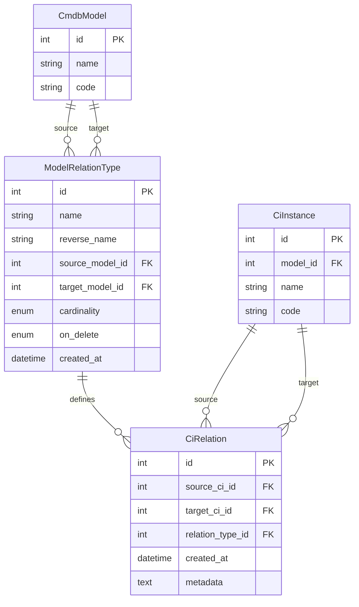

# Data Model: CMDB Model Relationships

**Feature**: CMDB Model Relationships  
**Date**: 2026-02-14  
**Related Spec**: [spec.md](./spec.md) | [research.md](./research.md)

## Overview

This document defines the data model for CMDB relationship management, consisting of:
1. **ModelRelationType** - Schema-level relationship definitions between model types
2. **CiRelation** - Instance-level relationships between CI instances

## Entity: ModelRelationType

Defines the types of relationships that can exist between CMDB models.

### Fields

| Field | Type | Required | Description |
|-------|------|----------|-------------|
| id | Integer (PK) | Yes | Auto-increment primary key |
| name | String(100) | Yes | Forward direction name (e.g., "hosts", "contains") |
| reverse_name | String(100) | Yes | Reverse direction name (e.g., "runs on", "belongs to") |
| source_model_id | Integer (FK) | Yes | Source model (cmdb_models.id) |
| target_model_id | Integer (FK) | Yes | Target model (cmdb_models.id) |
| cardinality | Enum | Yes | ONE_TO_ONE, ONE_TO_MANY, MANY_TO_ONE, MANY_TO_MANY |
| description | Text | No | Human-readable description |
| on_delete | Enum | No | CASCADE, RESTRICT, SET_NULL (default: RESTRICT) |
| created_at | DateTime | Yes | Creation timestamp |
| created_by | Integer (FK) | No | User who created this relation type |

### Validation Rules

- **VR-001**: `name` must be unique within the same source_model_id and target_model_id combination
- **VR-002**: `source_model_id` and `target_model_id` must reference existing CmdbModel records
- **VR-003**: Self-referencing relationships allowed (source_model_id == target_model_id)
- **VR-004**: `cardinality` must be one of the defined enum values
- **VR-005**: Changing cardinality is prohibited if instance relationships exist

### Relationships

```
ModelRelationType ||--o{ CmdbModel : source_model
ModelRelationType ||--o{ CmdbModel : target_model
ModelRelationType ||--o{ User : created_by
ModelRelationType ||--o{ CiRelation : relation_type
```

### State Transitions

- **Created**: Initial state when administrator defines a new relationship type
- **Active**: Available for creating instance relationships
- **Deprecated**: Soft-delete state - existing relations remain but new ones cannot be created

---

## Entity: CiRelation

Represents actual relationships between CI instances.

### Fields

| Field | Type | Required | Description |
|-------|------|----------|-------------|
| id | Integer (PK) | Yes | Auto-increment primary key |
| source_ci_id | Integer (FK) | Yes | Source CI instance (ci_instances.id) |
| target_ci_id | Integer (FK) | Yes | Target CI instance (ci_instances.id) |
| relation_type_id | Integer (FK) | Yes | Relationship type (model_relation_types.id) |
| created_at | DateTime | Yes | Creation timestamp |
| created_by | Integer (FK) | No | User who created this relation |
| metadata | Text (JSON) | No | Optional relationship attributes (e.g., port numbers) |

### Validation Rules

- **VR-006**: `(source_ci_id, target_ci_id, relation_type_id)` must be unique
- **VR-007**: `source_ci_id` and `target_ci_id` must reference existing CiInstance records
- **VR-008**: Source CI's model must match relation type's source_model_id
- **VR-009**: Target CI's model must match relation type's target_model_id
- **VR-010**: Cardinality constraints must be enforced:
  - **ONE_TO_ONE**: Only one relation allowed per source AND per target for this type
  - **ONE_TO_MANY**: Only one relation allowed per source for this type
  - **MANY_TO_ONE**: Only one relation allowed per target for this type
  - **MANY_TO_MANY**: No cardinality constraints
- **VR-011**: Circular relationship detection - prevent A→B→C→A cycles (configurable)

### Database Constraints

```sql
-- Unique constraint for duplicate prevention
UNIQUE (source_ci_id, target_ci_id, relation_type_id)

-- Indexes for query performance
CREATE INDEX idx_ci_relations_source ON ci_relations(source_ci_id, relation_type_id);
CREATE INDEX idx_ci_relations_target ON ci_relations(target_ci_id, relation_type_id);
CREATE INDEX idx_ci_relations_type ON ci_relations(relation_type_id);
```

### Relationships

```
CiRelation }o--|| CiInstance : source_ci
CiRelation }o--|| CiInstance : target_ci
CiRelation }o--|| ModelRelationType : relation_type
CiRelation }o--o| User : created_by
```

### Cascade Behavior

Based on `ModelRelationType.on_delete`:

- **CASCADE**: When source or target CI is deleted, delete the relationship
- **RESTRICT**: Prevent CI deletion if relationships exist (default)
- **SET_NULL**: Set the corresponding CI reference to NULL (not applicable for required FKs)

---

## Entity Relationship Diagram



---

## Migration Strategy

### Existing Data Migration

Current `CiRelation` table has a simple `relation_type` string field. Migration steps:

1. Create `model_relation_types` table
2. Insert default relationship types based on existing unique `relation_type` values
3. Add `relation_type_id` column to `ci_relations` (nullable initially)
4. Map existing records to new relation types
5. Make `relation_type_id` NOT NULL
6. Drop old `relation_type` column
7. Add new constraints and indexes

### Backward Compatibility

- Phase 1: Deploy schema changes, dual-write to old and new columns
- Phase 2: Backfill existing data
- Phase 3: Switch reads to new column
- Phase 4: Remove old column

---

## Query Patterns

### Get all relationships for a CI (both directions)

```python
# Get relations where CI is source
source_relations = CiRelation.query.filter_by(source_ci_id=ci_id).all()

# Get relations where CI is target  
target_relations = CiRelation.query.filter_by(target_ci_id=ci_id).all()

# Combined with type info
relations = db.session.query(CiRelation, ModelRelationType).join(
    ModelRelationType
).filter(
    (CiRelation.source_ci_id == ci_id) | (CiRelation.target_ci_id == ci_id)
).all()
```

### Get related CIs with specific relationship type

```python
# Forward direction
related_cis = CiInstance.query.join(
    CiRelation, CiInstance.id == CiRelation.target_ci_id
).filter(
    CiRelation.source_ci_id == source_ci_id,
    CiRelation.relation_type_id == relation_type_id
).all()

# Reverse direction
related_cis = CiInstance.query.join(
    CiRelation, CiInstance.id == CiRelation.source_ci_id
).filter(
    CiRelation.target_ci_id == target_ci_id,
    CiRelation.relation_type_id == relation_type_id
).all()
```

### Impact Analysis (multi-level traversal)

```python
def get_impact_tree(ci_id, max_depth=3, current_depth=0, visited=None):
    """Get all CIs affected by changes to given CI"""
    if visited is None:
        visited = set()
    if current_depth >= max_depth or ci_id in visited:
        return []
    
    visited.add(ci_id)
    
    # Get direct relations in both directions
    relations = CiRelation.query.filter(
        (CiRelation.source_ci_id == ci_id) | 
        (CiRelation.target_ci_id == ci_id)
    ).all()
    
    impact = []
    for rel in relations:
        related_ci_id = rel.target_ci_id if rel.source_ci_id == ci_id else rel.source_ci_id
        impact.append({
            'ci_id': related_ci_id,
            'relation': rel.to_dict(),
            'depth': current_depth + 1,
            'downstream': get_impact_tree(related_ci_id, max_depth, current_depth + 1, visited)
        })
    
    return impact
```

</content>